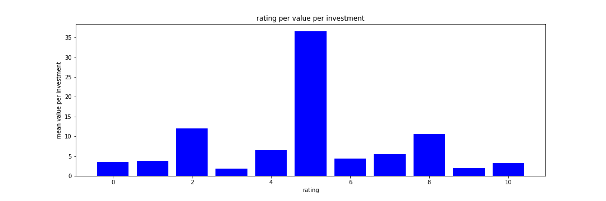

# Movie Preformence Analysis

**Author**: [Guy Muchnik](mailto:guymu15@gmail.com)

## Overview

this project analyzes the data found on imdb in the databases tn.movie_budgets.csv, imdb.title.basics.csv, tmdb.movies.csv regarding movies performance. descriptive analysis of the of movies production cost, income and rating.
## Business Problem


Production companies may be able to improve their investment to profits ratio by understanding the connection between them. doing so will allow them to use their money smarter. Also by catagorizing the data by genre production compenies can detect which gnre is more profitable for them and invest their money more wisely. Lastly by trying to find patterns in actors and the movie's preformance in specific genre a smarter usage of actors can be used to increase the return of the investment.

## Data

Database includes 1632 movies divided into 22 genres published between 2010 to 2020, every movie has its name as an ID, and data relating to the production investment, profits, rating and classification  

## Methods

This project uses descriptive analysis, including description of trends over genres. This provides a useful overview of movies preformence and allows for a better allocation of resources. 

## Results

Most movies are produced at under 100,000,000$ and Although movies that have been produced for more money earned more money the ratio in not better


looking at the mean of the value per investment for each rating score  we can see no obvious trend, each column is not related to the others. 


## Conclusions

This analysis leads to three recommendations for improving investment order for movies:

- **Invest no more than 100 million dollar in a production.** while investing more may get investers  more raw money the ratio of profit for investment is best at this range.
- **Combine the genres mystery and horror in the movie for best returns.** this genres have shown the best mean profit for investment and rating per investment.  
- **For higher profit add thriller aspects.** our analysis shows that thrillers tend to get higher profit for investment.
- **There seem to be no real correlation between rating to movies profit.** as seen already we can assume that by aiming for a higher rated movie we won't get higher profit margin.


## For More Information

See the full analysis in the [Jupyter Notebook](./student.ipynb) or review this [presentation](./Movie performance analysis.pdf).

For additional info, contact Guy Muchnik at [guymu15@gmail.com](mailto:guymu15@gmail.com)


## Repository Structure

```

├── zippedData
├── graphs
├── CONTRIBUTING.md
├── LICENSE.md
├── Movie performance analysis.pdf
├── student.ipynb
└── README.md
```